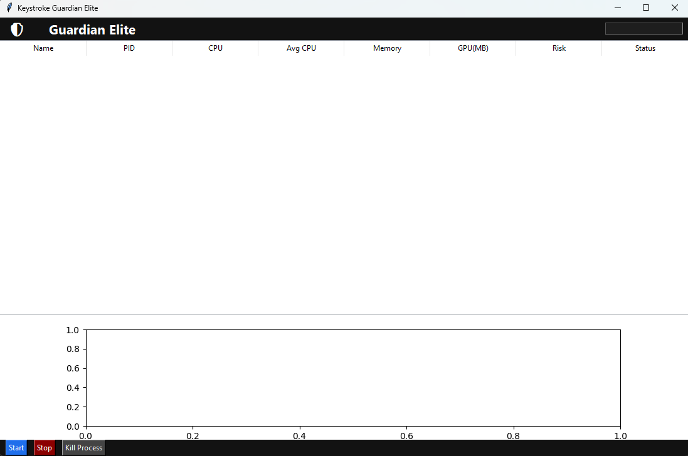
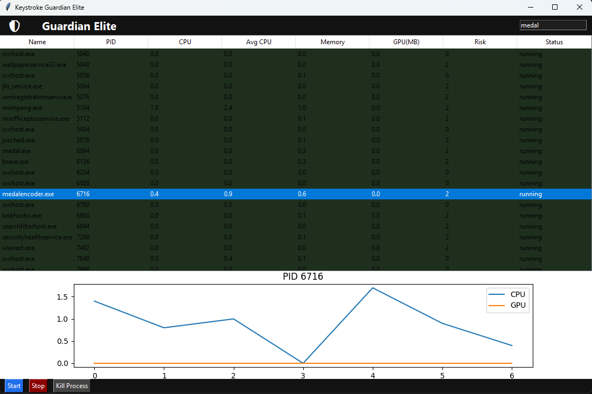
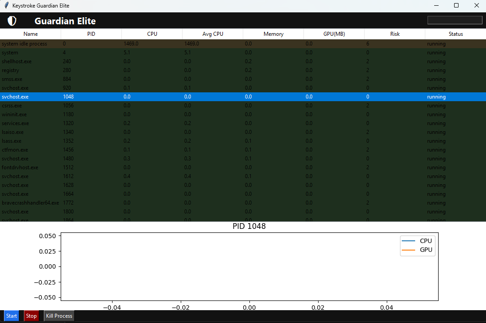

&#x20;🛡️ Keystroke Guardian Elite


Keystroke Guardian Elite is a real-time system monitoring and anomaly detection tool built in Python.

It analyzes running processes using behavioral patterns and resource usage to identify potentially suspicious activity, including crypto-mining behavior.


&#x20;🚀 Key Features


🔍 Real-Time Process Monitoring\*\*

&#x20; Continuously scans all active processes on the system.


&#x20;🧠 Behavior-Based Risk Scoring Engine

&#x20; Assigns a dynamic risk score based on multiple system metrics.


&#x20;🎮 GPU Usage Tracking

&#x20; Detects abnormal GPU activity using NVIDIA system tools.


&#x20;📊 Live Performance Visualization\*\*

&#x20; Displays CPU and GPU usage trends over time using interactive graphs.


⚠️ Suspicious Process Detection\*\*

&#x20; Flags processes with abnormal behavior patterns.


🛠️ Process Control (Kill Feature)\*\*

&#x20; Allows termination of suspicious processes directly from the interface.


&#x20;🔎 Search \& Filtering System\*\*

&#x20; Quickly locate specific processes.


&#x20;🌙 Modern Dark Mode Interface\*\*

&#x20; Clean and readable UI built with tkinter.


&#x20;🧠 Detection Logic


The system evaluates each process using a \*\*multi-factor risk model\*\*, including:


\* CPU usage (instant + average over time)

\* Memory consumption

\* GPU usage (for detecting mining-like behavior)

\* Process trust level (known system processes vs unknown)

\* Execution behavior patterns


&#x20;🚨 Example Detection Cases


\* High CPU + High GPU usage → potential crypto miner

\* Unknown process with abnormal behavior → flagged as suspicious

\* Sudden resource spikes → increased risk score


\---


&#x20;🏗️ System Architecture


\* \*\*Data Collection Layer\*\* → `psutil` (process monitoring)

\* \*\*GPU Monitoring Layer\*\* → `nvidia-smi` integration

\* \*\*Analysis Engine\*\* → custom risk scoring system

\* \*\*Visualization Layer\*\* → `matplotlib` graphs

\* \*\*Interface Layer\*\* → `tkinter` GUI


\---


&#x20;📸 Screenshots

 



▶️ Installation \& Usage


&#x20;1️⃣ Clone the repository


```bash id="jplg5f"

git clone https://github.com/KISUKE111/keystroke-guardian-elite.git

cd keystroke-guardian-elite

```


2️⃣ Install dependencies


```bash id="m2q7rn"

pip install -r requirements.txt

```


&#x20;3️⃣ Run the application


```bash id="x4y9fh"

python guardian.py

```


&#x20;⚙️ Requirements


\* Python 3.9+

\* Windows OS (for full GPU tracking support)

\* NVIDIA GPU (optional, for GPU monitoring)


\---


&#x20;📁 Project Structure


```plaintext

keystroke-guardian-elite/

├── guardian.py

├── requirements.txt

├── README.md

├── .gitignore

├── screenshots/

└── docs/

```


\---


&#x20;🎯 Learning Outcomes


This project demonstrates:


\* System-level programming in Python

\* Real-time data processing

\* Behavioral analysis and anomaly detection

\* GUI development

\* Integration with system tools


\---


&#x20;⚠️ Disclaimer


This project is developed strictly for \*\*educational and research purposes\*\*.

It is not intended for malicious use.


\---


&#x20;📌 Future Improvements


\* Auto-start with system boot

\* Real-time alert notifications

\* Advanced anomaly detection (AI-based)

\* Cross-platform support


\---


&#x20;👤 Author


Developed by \[MOHAMED AMINE MOHAMMADI]


